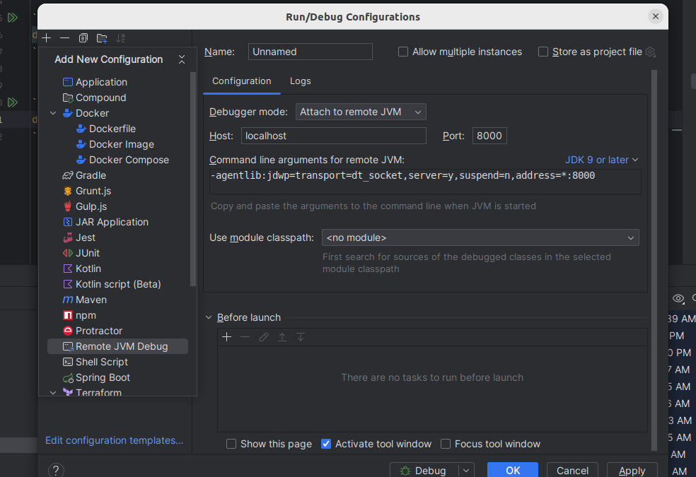

#### entrypoint.sh
```shell
java -agentlib:jdwp=transport=dt_socket,server=y,suspend=n,address=*:8000 -jar demo3-0.0.1-SNAPSHOT.jar
```
```shell
docker build -t  demo3-docker:0.0.1 .
```


```shell
docker run -p 8080:8080 -p 8000:8000 demo3-docker:0.0.1
```

